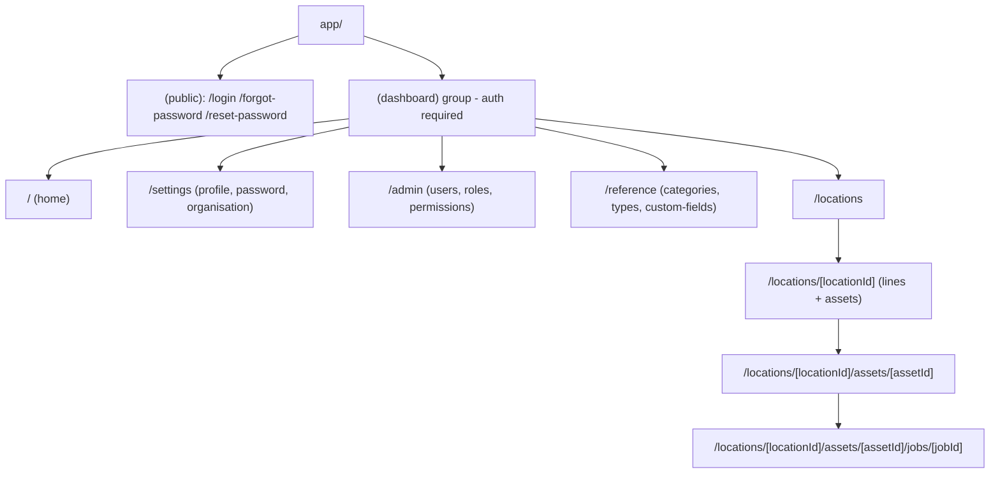
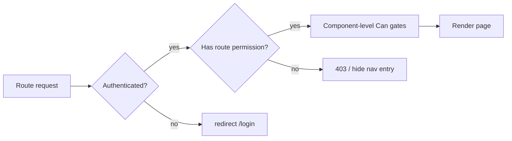

# DARCA UI Requirements Map

Frontend-sourced map derived from [api.ts](darca-client/lib/api/api.ts), the hooks in [hooks/data](darca-client/hooks/data), the permission model in [permissions.ts](darca-client/lib/auth/permissions.ts), and the session/guard wiring in [auth.ts](darca-client/auth.ts).

What changed since the old [DARCA Application Map](.cursor/plans/darca_application_map_6a079617.plan.md): the `/me` gap is **closed** — `getMe()` returns `roles` + `permissions`, these are baked into the NextAuth session ([auth.ts](darca-client/auth.ts)), and exposed via `useAuth()` → `usePermission()` → `<Can>`. So all permission gating is now possible client-side. Today the UI only ships `Home`, the 3 auth pages, and a [dashboard-shell](darca-client/components/dashboard/dashboard-shell.tsx) with a single nav item.

Route decision (confirmed): location-scoped resources are **nested under location**.

---

## 1. Routing, layout & guard architecture

### Route tree (Next.js app-router)

### Three guard layers

- **Layer 1 - Auth guard (route middleware).** `auth.ts` already defines the `authorized` callback, but there is **no `middleware.ts`** wiring it, so routes are currently unprotected server-side. Add `darca-client/middleware.ts` exporting `auth` so unauthenticated users are redirected to `/login` and logged-in users are bounced off the public pages.
- **Layer 2 - Permission route guard.** A new `<RequirePermission permission|any|all fallback>` client component (mirroring [can.tsx](darca-client/components/can.tsx) but for whole pages) that reads `usePermission()` and renders a 403 state or redirects when the user lacks the route's minimum permission. Applied at the top of each protected page (or via a small per-section `layout.tsx`).
- **Layer 3 - Component gates.** Existing [`<Can>`](darca-client/components/can.tsx) hides buttons/tabs/menu items for actions the user cannot perform (create/update/delete/assign).

### Navigation
Rebuild [nav-items.ts](darca-client/components/dashboard/nav-items.ts) so each entry carries a `permission` (or `any: PermissionCode[]`); [dashboard-shell](darca-client/components/dashboard/dashboard-shell.tsx) filters items through `usePermission().hasAny(...)` so users only see sections they can enter.

### Shared building blocks to add
- `<RequirePermission>` (page guard) and `<PermissionDenied>` (403 state)
- `<PageHeader title actions breadcrumbs>` wrapper
- `<DataTable>` wrapper around antd `Table` with loading/empty/error states tied to SWR `{ data, isLoading, error }`
- `<EntityDrawerForm>` / modal form pattern for create+edit (antd `Form` + `useApiMutation` trigger)
- `<ConfirmDelete>` (decommission/delete confirmation)
- `<StatusTag>` / `<PriorityTag>` / `<CriticalityTag>` for enum rendering
- `useOrgId()` convenience hook (`useAuth().user?.organisationId`) — every org-scoped hook needs it

---

## 2. Permission catalog (route gate reference)

From [permissions.ts](darca-client/lib/auth/permissions.ts) — 47 codes. Read codes gate *entering* a section; write codes gate *actions* inside.

- organisation: `organisation:read`, `organisation:update`
- user: `user:read|create|update|decommission|assign_roles`
- role: `role:read|create|update|delete|assign_permissions`
- permission: `permission:read`
- location: `location:read|create|update|decommission`
- line: `line:read|create|update|decommission`
- reference: `category:read|manage`, `type:read|manage`, `custom_field:read|manage`
- asset: `asset:read|create|update|decommission|assign`, `asset_identifier:manage`, `asset_attachment:read|manage`
- compliance: `compliance_schedule:read|create|update|decommission`
- job: `job:read|create|update|assign|execute|record_compliance|archive`, `job_history:read`

---

## 3. Page inventory

Per page: **Path** + **Route guard**, then **On-page** (components with the data fields they show and the permission that reveals them) and **Sub-views** (each modal/drawer/form, its trigger gate, its fields, the mutation hook, and what it does). Field names come from the generated DTOs in [schema.ts](darca-client/lib/api/generated/schema.ts).

### Full path index

- `/login`, `/forgot-password`, `/reset-password` (public)
- `/` home
- `/settings`, `/settings/organisation`
- `/admin/users`, `/admin/users/[userId]`
- `/admin/roles`, `/admin/roles/[roleId]`
- `/admin/permissions`
- `/reference/categories`, `/reference/categories/[categoryId]`
- `/reference/types`, `/reference/types/[typeId]`
- `/reference/custom-fields`, `/reference/custom-fields/[fieldId]`
- `/locations`, `/locations/[locationId]`
- `/locations/[locationId]/lines/[lineId]`
- `/locations/[locationId]/assets`, `/locations/[locationId]/assets/[assetId]`
- `/locations/[locationId]/assets/[assetId]/compliance/[scheduleId]`
- `/locations/[locationId]/assets/[assetId]/jobs/[jobId]`

---

### 3.1 Auth (public, no guard)

- **`/login`** ([login-form.tsx](darca-client/app/login/login-form.tsx)) — email + password form → NextAuth `signIn("credentials")`. Handles: invalid creds, decommissioned user, password-not-set. Link to `/forgot-password`.
- **`/forgot-password`** — email field → `requestPasswordReset(email)`; always shows generic success copy (no account enumeration).
- **`/reset-password?token=`** — on mount `validateResetToken(token)`; if valid show newPassword + confirm form → `resetPassword(token, newPassword)` then redirect to `/login`; if invalid show expired-token state.

### 3.2 Home `/` — guard: authenticated

- **On-page:**
  - Greeting card — shows `useAuth().user.name`, `roles`.
  - Shortcut tiles — one per section, each wrapped in `<Can>` so a tile only appears if the user holds that section's read permission (e.g. Assets tile needs `asset:read`).
  - Location quick-jump (optional) — `useOrganisationLocations(orgId)`, visible with `location:read`.
- **Sub-views:** none.

### 3.3 Settings

**`/settings`** — guard: authenticated (self).
- **On-page:** read-only profile card (`useAuth().user`: name, email, roles). "Change password" button.
- **Sub-views:**
  - *Change password modal* — fields `currentPassword`, `newPassword`, confirm → `useChangePassword()` → `PUT /auth/password`. On success: toast + close. No permission gate (self-service).

**`/settings/organisation`** — guard: `organisation:read`.
- **On-page:** org details (`useOrganisation(orgId)`: `name`, `createdAt`). "Edit" button gated by `organisation:update`.
- **Sub-views:**
  - *Edit organisation form* (inline or modal, gate `organisation:update`) — field `name` → `useUpdateOrganisation(orgId)` → updates org name.

### 3.4 Administration

Section guard: `hasAny([user:read, role:read, permission:read])`. All org-scoped; `orgId` from session.

**`/admin/users`** — guard: `user:read`.
- **On-page:** `<DataTable>` from `useOrganisationUsers(orgId, {includeDecommissioned})` showing `name`, `email`, `active`, `decommissionedAt`. Row → user detail. Toolbar: "Include decommissioned" switch; "New user" button gated `user:create`.
- **Sub-views:**
  - *Create user modal* (gate `user:create`) — fields `name`, `email`, optional `password` → `useCreateOrganisationUser(orgId)`. Creates org member; if no password, account awaits reset/set.

**`/admin/users/[userId]`** — guard: `user:read`. Layout: header + tabs (Profile / Org roles / Location roles).
- **On-page Profile tab:** `useOrganisationUser(orgId, userId)` showing `name`, `email`, `active`, `decommissionedAt`, timestamps. Buttons: "Edit" (`user:update`), "Set password" (`user:update`), "Decommission" (`user:decommission`).
- **On-page Org roles tab:** multiselect of roles from `useOrganisationRoles(orgId)` pre-seeded with current assignments from `useUserOrganisationRoles(userId)` (gate `user:assign_roles`).
- **On-page Location roles tab:** location selector (`useOrganisationLocations`) + per-location role multiselect pre-seeded from `useUserLocationRoles(userId, locationId)` when a location is selected (gate `user:assign_roles`).
- **Sub-views:**
  - *Edit user form* (gate `user:update`) — field `name` → `useUpdateOrganisationUser` (email immutable).
  - *Set password modal* (gate `user:update`) — field `password` → `useSetUserPassword(userId)` → admin sets/overrides password.
  - *Decommission confirm* (`<ConfirmDelete>`, gate `user:decommission`) — → `useDeleteOrganisationUser` (soft delete).
  - *Replace org roles* (gate `user:assign_roles`) — pre-fills `roleIds[]` from `useUserOrganisationRoles(userId)` → `useUpdateUserOrganisationRoles(userId)` → replaces all org-wide roles.
  - *Replace location roles* (gate `user:assign_roles`) — pre-fills `roleIds[]` for a `locationId` from `useUserLocationRoles(userId, locationId)` → `useUpdateUserLocationRoles(userId, locationId)`.
- **Client additions required:** add `getUserOrganisationRoles(userId)` and `getUserLocationRoles(userId, locationId)` GET functions to `lib/api/api.ts`; add `useUserOrganisationRoles(userId)` and `useUserLocationRoles(userId, locationId)` SWR hooks to `hooks/data/use-rbac.ts` (query keys `userOrganisationRoles` / `userLocationRoles` already exist in `query-keys.ts`).

**`/admin/roles`** — guard: `role:read`.
- **On-page:** `<DataTable>` from `useOrganisationRoles(orgId)` showing `name`, `description`, `system` badge, `permissionCount`. Row → role detail. "New role" gated `role:create`.
- **Sub-views:**
  - *Create role modal* (gate `role:create`) — fields `name`, `description` → `useCreateOrganisationRole(orgId)`.

**`/admin/roles/[roleId]`** — guard: `role:read`. Layout: metadata panel + permission matrix.
- **On-page:** `useOrganisationRole(orgId, roleId)` showing `name`, `description`, `system`, embedded `permissions[]`. Permission matrix grouped by `permissionGroup` (checkboxes), seeded from `usePermissions()` catalog and ticked from the role's `permissions`. Buttons: "Edit" (`role:update`), "Save permissions" (`role:assign_permissions`), "Delete" (`role:delete`, hidden/disabled when `system`).
- **Sub-views:**
  - *Edit role form* (gate `role:update`) — fields `name`, `description` → `useUpdateOrganisationRole`.
  - *Permission matrix save* (gate `role:assign_permissions`) — submit `permissionIds[]` → `useUpdateOrganisationRolePermissions` → replaces the role's full permission set.
  - *Delete role confirm* (gate `role:delete`) — → `useDeleteOrganisationRole`; blocked for system roles.

**`/admin/permissions`** — guard: `permission:read`.
- **On-page:** read-only accordion/list from `usePermissions()` (`PermissionGroupResponse[]`) — groups with `name`, `description`, `displayOrder`. Reference only.
- **Sub-views:** none.

### 3.5 Reference data (global, not org-scoped)

Section guard: `hasAny([category:read, type:read, custom_field:read])`.

**`/reference/categories`** — guard: `category:read`.
- **On-page:** `<DataTable>` from `useCategories()` (`name`, `description`). "New category" gated `category:manage`.
- **Sub-views:** *Create category modal* (gate `category:manage`) — fields `name`, `description` → `useCreateCategory()`.

**`/reference/categories/[categoryId]`** — guard: `category:read`.
- **On-page:** `useCategory(id)` (`name`, `description`, embedded `customFields[]`). Linked custom-fields panel listing each field's `label`, `dataType`, `required`. Buttons: "Edit" / "Manage fields" / "Delete" all gated `category:manage`.
- **Sub-views:**
  - *Edit category form* (gate `category:manage`) — `name`, `description` → `useUpdateCategory(id)`.
  - *Manage linked fields drawer* (gate `category:manage`) — multiselect from `useCustomFields()`, submit `customFieldIds[]` → `useUpdateCategoryCustomFields(id)` → defines which custom fields apply to assets of this category.
  - *Delete category confirm* (gate `category:manage`) — → `useDeleteCategory(id)` (hard delete).

**`/reference/types`** + **`/reference/types/[typeId]`** — guard: `type:read`.
- **On-page:** list from `useTypes()` (`name`, `description`); detail via `useType(id)`. "New type" / "Edit" / "Delete" gated `type:manage`.
- **Sub-views:** *Create/Edit type form* (`name`, `description`) → `useCreateType` / `useUpdateType`; *Delete confirm* → `useDeleteType`.

**`/reference/custom-fields`** + **`/reference/custom-fields/[fieldId]`** — guard: `custom_field:read`.
- **On-page:** list from `useCustomFields()` (`label`, `dataType`, `required`); detail via `useCustomField(id)`. Actions gated `custom_field:manage`.
- **Sub-views:** *Create/Edit field form* — fields `label`, `dataType` (TEXT|NUMBER|DATE|BOOLEAN|SELECT), `required` → `useCreateCustomField` / `useUpdateCustomField`; *Delete confirm* → `useDeleteCustomField`.

### 3.6 Locations & lines

**`/locations`** — guard: `location:read`.
- **On-page:** `<DataTable>`/cards from `useOrganisationLocations(orgId)` (`name`, `address`, `timezone`, `decommissionedAt`). Row → location detail. "New location" gated `location:create`.
- **Sub-views:** *Create location modal* (gate `location:create`) — `name`, `address`, `timezone` → `useCreateOrganisationLocation(orgId)`.

**`/locations/[locationId]`** — guard: `location:read`. Layout: details panel + tabs (Lines / Assets). Location roles apply here.
- **On-page Details:** `useOrganisationLocation(orgId, locationId)` (`name`, `address`, `timezone`). Buttons "Edit" (`location:update`), "Decommission" (`location:decommission`).
- **On-page Lines tab:** `<DataTable>` from `useLocationLines(locationId)` (`name`, `description`). "New line" gated `line:create`; row → line detail.
- **On-page Assets tab:** entry/link into the asset list (§3.7).
- **Sub-views:**
  - *Edit location form* (gate `location:update`) — `name`, `address`, `timezone` → `useUpdateOrganisationLocation`.
  - *Decommission location confirm* (gate `location:decommission`) — → `useDeleteOrganisationLocation`.
  - *Create line modal* (gate `line:create`) — `name`, `description` → `useCreateLocationLine(locationId)`.

**`/locations/[locationId]/lines/[lineId]`** — guard: `line:read`.
- **On-page:** `useLocationLine(locationId, lineId)` (`name`, `description`, `decommissionedAt`). Actions: "Edit" (`line:update`), "Decommission" (`line:decommission`).
- **Sub-views:** *Edit line form* → `useUpdateLocationLine`; *Decommission confirm* → `useDeleteLocationLine`.

### 3.7 Assets (nested under location)

**`/locations/[locationId]/assets`** — guard: `asset:read`.
- **On-page:** filter bar (`status` from `useAssetStatuses()`, `categoryId` from `useCategories()`) + `<DataTable>` from `useLocationAssets(locationId, {status, categoryId})` showing `name`, `categoryName`, `typeName`, `lineName`, `<StatusTag>` (`statusLabel`), `<CriticalityTag>` (`criticality`). Row → asset detail. "New asset" gated `asset:create`.
- **Sub-views:**
  - *Create asset modal/drawer* (gate `asset:create`) — fields `categoryId` (req), `typeId` (req), `lineId` (opt, from `useLocationLines`), `name` (req), `modelNumber`, `manufacturer`, `status` (from statuses), `criticality`, `purchaseDate`, `purchaseCost`, `warrantyExpiry`, `specificLocationDetails`, `geoLatitude`, `geoLongitude` → `useCreateAsset(locationId)`.

**`/locations/[locationId]/assets/[assetId]`** — guard: `asset:read`. Layout: header (name, `<StatusTag>`, `<CriticalityTag>`) + tabs. Root data: `useAsset(locationId, assetId)` (embeds `identifiers`, `customFields`, `attachments`, `assignments`).
- **Overview tab** — shows core fields (`categoryName`, `typeName`, `lineName`, `modelNumber`, `manufacturer`, purchase/warranty, geo, `specificLocationDetails`). Buttons "Edit" (`asset:update`), "Decommission" (`asset:decommission`).
  - *Edit asset form* (gate `asset:update`, location-scoped) — same fields as create minus category/type → `useUpdateAsset(locationId, assetId)`.
  - *Decommission confirm* (gate `asset:decommission`) → `useDeleteAsset`.
- **Identifiers tab** — table of embedded `identifiers` (`type`, `value`, `active`). "Manage" gated `asset_identifier:manage`.
  - *Edit identifiers drawer* — editable rows of `{type, value, active}` (types: SERIAL_NUMBER|BARCODE|QR_CODE|RFID|TAG|ASSET_TAG); submit full `identifiers[]` → `useReplaceAssetIdentifiers` (bulk replace, org-only path).
- **Custom fields tab** — embedded `customFields` (`label`, `dataType`, `value`). "Edit values" gated `asset:update`.
  - *Edit custom-field values form* — input per field rendered by `dataType`; submit `values[] {customFieldId, value}` → `useReplaceAssetCustomFields` (bulk replace, org-only).
- **Attachments tab** — guard `asset_attachment:read`; list from `useAssetAttachments` (`fileName`, `fileType`, `url`, `createdAt`) with download links. "Upload" / "Delete" gated `asset_attachment:manage`.
  - *Upload attachment* (gate manage) — file picker (multipart) → `useUploadAssetAttachment(assetId)`.
  - *Delete attachment confirm* (gate manage) → `useDeleteAssetAttachment`.
- **Assignments tab** — embedded `assignments` (`userName`). "Assign user" / remove gated `asset:assign`.
  - *Assign user modal* (gate `asset:assign`) — user picker from `useOrganisationUsers(orgId)`, submit `userId` → `useAssignAssetUser`.
  - *Unassign confirm* (gate `asset:assign`) → `useUnassignAssetUser`.
- **Status history tab** — read-only timeline from `useAssetStatusHistory` (`statusLabel`, `changedByUserName`, `notes`, `createdAt`). Gate `asset:read`.
- **Compliance tab** — see §3.8. **Jobs tab** — see §3.9.

### 3.8 Compliance schedules (asset tab + detail)

**Compliance tab** (on asset detail) — guard `compliance_schedule:read`.
- **On-page:** `<DataTable>` from `useAssetComplianceSchedules(assetId)` (`title`, `frequencyInterval`+`frequencyUnit`, `nextDueDate`, `lastTriggeredAt`, `active`). "New schedule" gated `compliance_schedule:create`.
- **Sub-views:** *Create schedule modal* (gate create) — `title`, `description`, `frequencyInterval`, `frequencyUnit` (HOURS|DAYS|WEEKS|MONTHS|YEARS), `nextDueDate` → `useCreateAssetComplianceSchedule(assetId)`.

**`/locations/[locationId]/assets/[assetId]/compliance/[scheduleId]`** — guard `compliance_schedule:read`.
- **On-page:** `useAssetComplianceSchedule(assetId, scheduleId)` full fields. "Edit" (`compliance_schedule:update`), "Decommission" (`compliance_schedule:decommission`).
- **Sub-views:** *Edit schedule form* — adds `active` toggle → `useUpdateAssetComplianceSchedule`; *Decommission confirm* → `useDeleteAssetComplianceSchedule`. Note: schedules are manual record-keeping (no auto job generation).

### 3.9 Jobs / work orders (asset tab + detail)

**Jobs tab** (on asset detail) — guard `job:read`.
- **On-page:** filters (`status`, `priority`) + `<DataTable>` from `useAssetJobs(assetId, {status, priority})` (`title`, `<StatusTag>`, `<PriorityTag>`, `type`, `dueDate`, `complianceResult`). Row → job detail. "New job" gated `job:create`.
- **Sub-views:** *Create job modal* (gate create) — `title`, `description`, `type` (PREVENTATIVE|CORRECTIVE|INSPECTION|EMERGENCY), `priority`, `dueDate` (req), optional `complianceScheduleId` (from `useAssetComplianceSchedules`), optional `parentJobId` → `useCreateAssetJob(assetId)`.

**`/locations/[locationId]/assets/[assetId]/jobs/[jobId]`** — guard `job:read`. Layout: header with lifecycle buttons + tabs (Details / Assignments / History).
- **On-page Details:** `useJob(jobId)` (`title`, `description`, `type`, `<PriorityTag>`, `<StatusTag>`, `dueDate`, `startedAt`, `completedAt`, `archivedAt`, `complianceResult`). Lifecycle buttons reflect status:
  - "Edit" gated `job:update`; "Start" (PENDING) gated `job:execute`; "Complete" (IN_PROGRESS) gated `job:record_compliance`; "Archive" (COMPLETED) gated `job:archive`.
- **On-page Assignments tab:** embedded `assignments` (`userName`); add/remove gated `job:assign`.
- **On-page History tab:** guard `job_history:read`; timeline from `useJobHistory(jobId)` (`status`, `complianceResult`, `notes`, `performedByUserName`, `createdAt`).
- **Sub-views:**
  - *Edit job form* (gate `job:update`) — `title`, `description`, `priority`, `dueDate` → `useUpdateJob`.
  - *Start job confirm* (gate `job:execute`) → `useStartJob` (PENDING→IN_PROGRESS).
  - *Complete job modal* (gate `job:record_compliance`) — `complianceResult` (PASS|FAIL|NOT_APPLICABLE), `notes` → `useCompleteJob` (IN_PROGRESS→COMPLETED).
  - *Archive confirm* (gate `job:archive`) → `useArchiveJob` (COMPLETED→ARCHIVED).
  - *Assign user modal* (gate `job:assign`) — user picker (`useOrganisationUsers`), `userId` → `useAssignJobUser`; *Unassign confirm* → `useUnassignJobUser`.

Lifecycle: PENDING →(`job:execute`)→ IN_PROGRESS →(`job:record_compliance`)→ COMPLETED →(`job:archive`)→ ARCHIVED.

---

## 4. Permission -> route guard matrix

- `/`, `/settings` (profile/password): authenticated only
- `/settings/organisation`: `organisation:read`
- `/admin/*` section: any of `user:read`, `role:read`, `permission:read`
  - `/admin/users*`: `user:read` · `/admin/roles*`: `role:read` · `/admin/permissions`: `permission:read`
- `/reference/*` section: any of `category:read`, `type:read`, `custom_field:read`
  - categories: `category:read` · types: `type:read` · custom-fields: `custom_field:read`
- `/locations*`: `location:read`
- `/locations/[id]/assets*`: `asset:read`
- compliance tab: `compliance_schedule:read` · attachments tab: `asset_attachment:read` · jobs tab/detail: `job:read`

Location-scope nuance to preserve in UI copy/empty-states: asset sub-resources (identifiers/custom-fields/attachments/assignments), compliance, and jobs are **org-only** API paths — a location-only role can list/read assets at its site but may be unable to mutate these sub-resources.

---

## 5. Data-hook -> page coverage (completeness check)

Every exported hook in [hooks/data](darca-client/hooks/data) maps to a page above: organisation→Settings; users+rbac→Admin; locations+lines→Locations; assets+compliance+jobs→Asset detail tabs; categories/types/custom-fields→Reference; auth-data→Settings/Login. No orphan hooks; no page lacks a backing hook.

**Hooks still to add** (backend endpoints exist, client wiring missing):
- `useUserOrganisationRoles(userId)` — calls `GET /users/{userId}/organisation-roles`; backs the Org roles tab pre-fill in `/admin/users/[userId]`.
- `useUserLocationRoles(userId, locationId)` — calls `GET /users/{userId}/locations/{locationId}/roles`; backs the Location roles tab pre-fill. Both go in `hooks/data/use-rbac.ts`; corresponding API functions go in `lib/api/api.ts`.

---

## 6. Backend/data gaps the UI must design around

- ~~**No GET for user role assignments**~~ — **Resolved.** `GET /users/{userId}/organisation-roles` and `GET /users/{userId}/locations/{locationId}/roles` now exist in `RbacController` and return `UserRoleAssignmentResponse` (`userId`, `locationId`, `roleIds[]`). The client still needs the API functions and SWR hooks (see §3.4 "Client additions required").
- **No org-wide asset/job lists** — all asset/job browsing must go through a location → asset path; home dashboard cannot show cross-site job queues yet.
- **No `middleware.ts`** — the `authorized` callback in [auth.ts](darca-client/auth.ts) is defined but not enforced; add middleware as Layer-1 guard.
- **Reference data is global**, not org-scoped — present as system-wide catalog.
- **No compliance→job scheduler** — schedules are manual record-keeping.

---

## 7. Suggested build order

1. Guard foundation: `middleware.ts`, `<RequirePermission>`, `<PermissionDenied>`, permission-aware `nav-items` + shell filtering.
2. Shared primitives: `<PageHeader>`, `<DataTable>`, form/modal pattern, `<ConfirmDelete>`, enum tags, `useOrgId`.
3. Settings (org + password) — smallest vertical slice to validate the stack.
4. Reference data (global, no nesting) — exercises CRUD + relations.
5. Admin (users, roles, permission matrix).
6. Locations → lines → assets (nested) → asset tabs.
7. Compliance + jobs (deepest nesting, lifecycle).